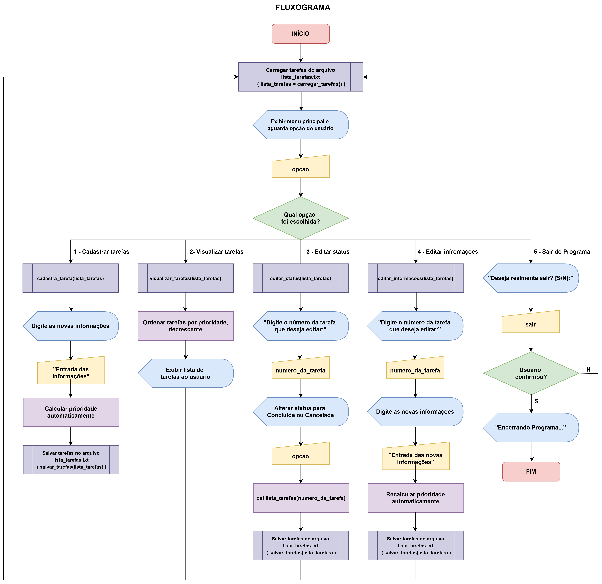

# Sistema de Organização de Prioridades em Lista de Tarefas

Projeto desenvolvido para a disciplina da Universidade Católica de Santos (UNISANTOS), com o objetivo de criar um sistema de gerenciamento de tarefas utilizando Python.

---

## Contexto

No cotidiano acadêmico e profissional, é comum lidar simultaneamente com diversas atividades e compromissos. A dificuldade em organizar tarefas e definir prioridades pode comprometer o gerenciamento do tempo e a produtividade.

Diante desse cenário, o projeto propõe o desenvolvimento de um sistema capaz de auxiliar os usuários na organização automática de tarefas com base em critérios de prioridade.

---

## Objetivo

Desenvolver um sistema capaz de organizar tarefas automaticamente com base em:

- Prazo de realização
- Nível de dificuldade

Auxiliando os usuários na definição de prioridades e no gerenciamento do tempo.

---

## Funcionalidades

✅ Cadastro de tarefas  
✅ Visualização de tarefas  
✅ Edição de informações  
✅ Conclusão e cancelamento de tarefas  
✅ Cálculo automático de prioridade  
✅ Organização automática por prioridade  
✅ Persistência de dados em arquivo `.txt`  
✅ Validação de entradas do usuário  

---

## Critérios de Priorização

O sistema calcula automaticamente a prioridade das tarefas considerando:

- Grau de dificuldade
- Quantidade de dias restantes até o prazo final

Tarefas com maior dificuldade e menor tempo disponível recebem maior prioridade no sistema.


## Estruturas Utilizadas

O sistema utiliza:

- Lista de listas para armazenamento das tarefas
- Funções e procedimentos para modularização
- Estruturas condicionais (`if` e `match-case`)
- Estruturas de repetição (`for` e `while`)
- Tratamento de exceções (`try` e `except`)
- Biblioteca `datetime` para manipulação de datas

---

## Estrutura da Matriz

Cada linha da matriz representa uma tarefa cadastrada:

```python
[0] Status
[1] Título
[2] Descrição
[3] Data Início
[4] Data Final
[5] Dificuldade
[6] Prioridade
```

---

## Fluxograma Simplificado do Sistema




---

## Testes e Validação

Foram realizados testes utilizando diferentes combinações de:

- Prazos
- Níveis de dificuldade
- Formatos de datas
- Campos vazios
- Entradas inválidas

Os resultados demonstraram o correto funcionamento das funcionalidades do sistema e do cálculo automático das prioridades.

---

## Tecnologias Utilizadas

- Python 3
- Visual Studio Code (VS Code)

---

## Como Executar o Projeto

### 1. Clone o repositório

```bash
git clone https://github.com/kauaasher/sistema-organizacao-prioridades-tarefas
```

---

### 2. Acesse a pasta do projeto

```bash
cd sistema-organizacao-prioridades-tarefas
```

---

### 3. Execute o programa

```bash
python Sistema_de_Organizacao_de_Prioridades.py
```

---

## Integrantes

- [Gabriel Coimbra Pajola Bernardi](https://github.com/gcoimbra28)
- [Gustavo Souza Recouso](https://github.com/GustavoRecouso)
- [Kauã Asher Ribeiro da Silva](https://github.com/kauaasher)
- [Kauan Barros Batista](https://github.com/KauanBarros-hub)
- [Pedro Henrique do Nascimento Melo](https://github.com/Shimatora1)

---

## Universidade

Universidade Católica de Santos — UNISANTOS

Cursos:
- Ciência da Computação
- Sistemas de Informação

---

## Licença

Projeto desenvolvido para fins acadêmicos.
